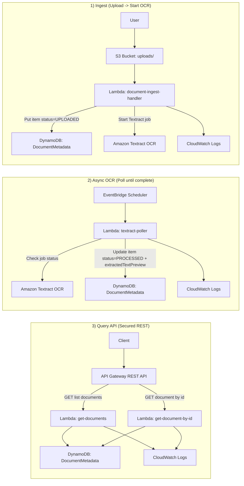

# Serverless Document Processing Pipeline (AWS)

## Overview
This project implements a **fully serverless, event-driven document processing system** on AWS. When a PDF is uploaded to Amazon S3, the system automatically extracts text using **Amazon Textract**, stores metadata and results in **Amazon DynamoDB**, and exposes secure REST APIs through **Amazon API Gateway**.

The solution is scalable and production-ready using only managed AWS services (no servers).

---

## Architecture Diagram (GitHub Mermaid Compatible)

> Notes for GitHub:
> - This diagram is written to be **GitHub-safe** (no HTML tags like `<br/>`, no `{}` in edge labels, and punctuation kept minimal).
> - The workflow order is **1) Ingest → 2) Async OCR → 3) Query API**.



---

## End-to-End Workflow

### 1) Upload a document to S3
Upload a PDF into the `uploads/` prefix (this is important so the trigger fires).
Example:
- `uploads/Resume_v3.pdf`

### 2) Ingest Lambda runs automatically
S3 triggers **document-ingest-handler**, which:
- Creates a new DynamoDB record (`status = UPLOADED`)
- Starts an **asynchronous Textract** OCR job

### 3) Polling updates the result
An **EventBridge Scheduler** triggers **textract-poller** on a schedule, which:
- Checks Textract job status
- When complete, updates DynamoDB with:
  - `status = PROCESSED`
  - `extractedTextPreview` (text snippet)
  - `textractJobId`

### 4) Query results via API Gateway
API Gateway exposes secure REST endpoints backed by Lambda functions:
- `GET /documents`  (list)
- `GET /documents/<documentId>` (single item)

---

## AWS Services Used
- **Amazon S3** – Storage + event trigger for new uploads
- **AWS Lambda** – Ingest, poll, and API handler functions
- **Amazon Textract** – OCR/text extraction (async job)
- **Amazon DynamoDB** – Document metadata + extracted text
- **Amazon EventBridge Scheduler** – Polling for job completion
- **Amazon API Gateway (REST)** – Public API endpoints (API key secured)
- **Amazon CloudWatch Logs** – Logging and operational visibility

---

## DynamoDB Table Design

**Table name:** `DocumentMetadata`  
**Partition key:** `documentId` (String)

Example item:
```json
{
  "documentId": "407834df-66b4-4fd5-a172-986a5072eb21",
  "s3Key": "uploads/Resume_v3.pdf",
  "status": "PROCESSED",
  "uploadedAt": "2026-01-12T19:44:55.396964+00:00",
  "textractJobId": "example-job-id",
  "extractedTextPreview": "Example preview text..."
}
```

---

## API (Security Enabled with API Key)

### Base URL
```
https://<api-id>.execute-api.us-east-1.amazonaws.com/prod
```

### List documents
**Method:** GET  
**Path:** `/documents`

**Example (curl):**
```bash
curl -i -H "x-api-key: YOUR_API_KEY" "https://<api-id>.execute-api.us-east-1.amazonaws.com/prod/documents"
```

### Get a document by id
**Method:** GET  
**Path:** `/documents/<documentId>`

**Example (curl):**
```bash
curl -i -H "x-api-key: YOUR_API_KEY" "https://<api-id>.execute-api.us-east-1.amazonaws.com/prod/documents/<documentId>"
```

### Expected responses
- **200 OK** with JSON when the API key is valid
- **403 Forbidden** when the API key is missing/invalid
- **Missing Authentication Token** when the URL path is wrong

---

## Observability (CloudWatch)

### API Gateway logging (Stage: prod)
Enabled:
- **CloudWatch logs:** error and info logs
- **Custom access logs**
- **Detailed metrics**

### Where to view logs
- API Gateway access logs: CloudWatch log group similar to:
  - `/aws/apigateway/doc-processor-api-prod`
- Lambda logs:
  - `/aws/lambda/<function-name>`

---

## Screenshots to Include (Portfolio / Submission)
1. **S3**: `uploads/` folder showing the PDF
2. **Lambda**: functions list
3. **DynamoDB**: item showing `status = PROCESSED`
4. **API Gateway**: stage `prod` and resources
5. **Terminal**: curl output showing **HTTP 200 OK**
6. **CloudWatch**: API access log showing status **200**

---

## Resume Summary (Copy-Ready)
**Serverless Document Processing Pipeline (AWS)**  
- Built an event-driven serverless pipeline where PDF uploads to S3 trigger Lambda ingestion and asynchronous Textract OCR.  
- Stored document metadata and extracted text in DynamoDB with lifecycle tracking (UPLOADED to PROCESSED).  
- Exposed secure REST APIs via API Gateway using API keys and usage plans for access control.  
- Enabled CloudWatch logs and API Gateway access logging to monitor latency and troubleshoot errors.

---

## Status
✅ End-to-end complete and tested
