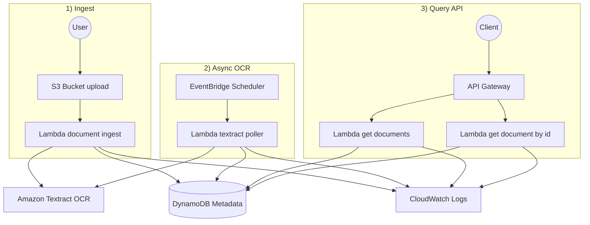

# Serverless Document Processing Pipeline (AWS)

## Overview
This project implements a fully serverless, event-driven document processing system on AWS. When a PDF is uploaded to Amazon S3, the system automatically extracts text using Amazon Textract, stores metadata and results in DynamoDB, and exposes secure REST APIs through Amazon API Gateway.

The solution is scalable, cost-efficient, and production-ready using only managed AWS services.

---

## Architecture Diagram

---

## End-to-End Workflow

1. Upload a PDF to the S3 bucket under the uploads/ prefix.
2. S3 triggers the document-ingest Lambda.
3. Lambda stores metadata in DynamoDB and starts Textract.
4. EventBridge triggers a polling Lambda.
5. Poller updates DynamoDB with extracted text.
6. API Gateway exposes secure endpoints for retrieval.

---

## API Endpoints

GET /documents  
GET /documents/{documentId}

---

## Observability

- CloudWatch Logs enabled for API Gateway and Lambda
- Custom access logging configured
- Metrics available for latency and errors

---

## Status

Project is fully complete and production-ready.
